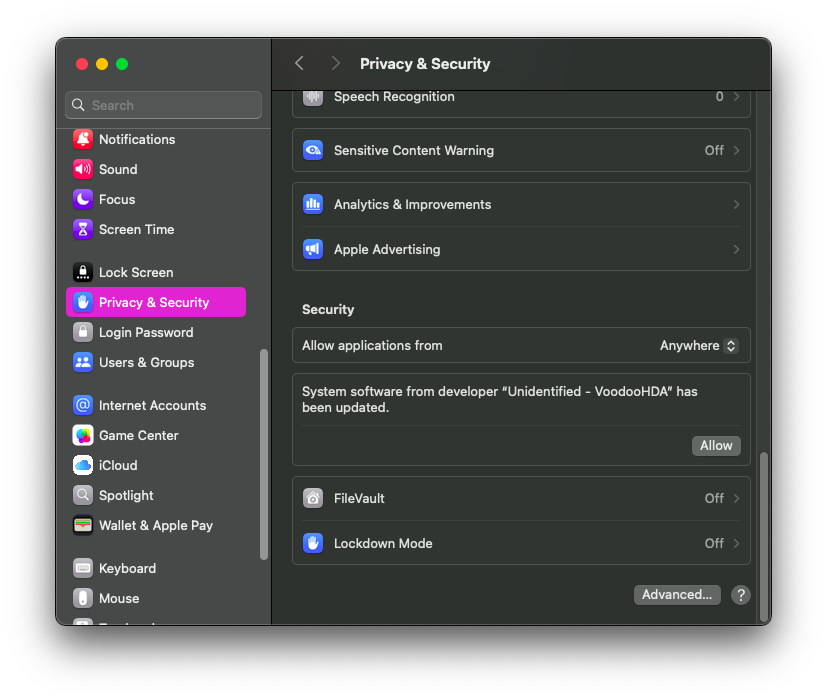

# VoodooHDAInstaller
Small bash script to install VoodooHDA.

### Installation
1. Run the command below via terminal

```curl -sL https://raw.githubusercontent.com/alvindimas05/VoodooHDAInstaller/refs/heads/main/install.sh | bash```

2. Allow permission on <b>Settings > Privacy & Security</b>


3. Reboot your machine.

### Uninstall
Run the command below to uninstall
```curl -sL https://raw.githubusercontent.com/alvindimas05/VoodooHDAInstaller/refs/heads/main/uninstall.sh | bash```

### Fix for Mic is showing but not getting any input (AMD/Intel)

1. Go to the System Settings > VoodooHDA.
2. Then select your microphone.
3. Set the **IMix** & **Speaker** slider to maximum.
Mic should work.

(Credits to [Sayor0630](https://github.com/Sayor0630))